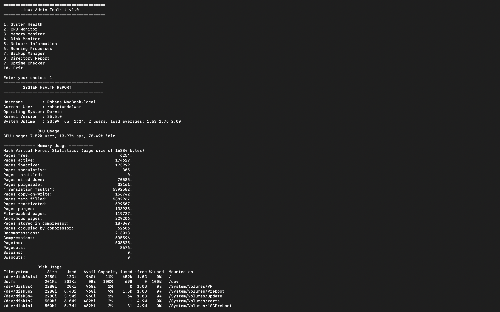

## 📸 Screenshots

### Main Menu


---

### System Health Report

# Linux Admin Toolkit

A collection of Linux administration utilities built using Bash scripting for DevOps and System Administration practice.

---

# 📌 Overview

Linux Admin Toolkit is a menu-driven Bash project that combines multiple Linux administration tasks into one toolkit.

The toolkit helps automate common system administration activities using simple shell scripts.

---

# 🚀 Modules Included

✅ Uptime Checker

Displays

- System Uptime
- Boot Time
- Load Average

---

✅ Backup Manager

Creates compressed backups of directories.

Features

- Source folder selection
- Backup destination
- Timestamped backup file

---

✅ Directory Report

Generates

- Number of files
- Number of directories
- Largest files
- Disk usage

---

# 🛠 Technologies

- Bash
- Linux
- Shell Scripting
- Terminal

---

# 📂 Project Structure

```
linux-admin-toolkit/
│
├── scripts/
│   ├── uptime_checker.sh
│   ├── backup_manager.sh
│   └── directory_report.sh
│
├── README.md
└── LICENSE
```

---

# 🎯 Features

- Interactive menu
- Bash automation
- Linux commands integration
- Easy to use
- Beginner friendly

---

# 📚 Commands Used

- uptime
- who
- df
- du
- tar
- find
- ls
- awk
- grep

---

# 👨‍💻 Author

**Rohan Tundalwar**

DevOps Learner
